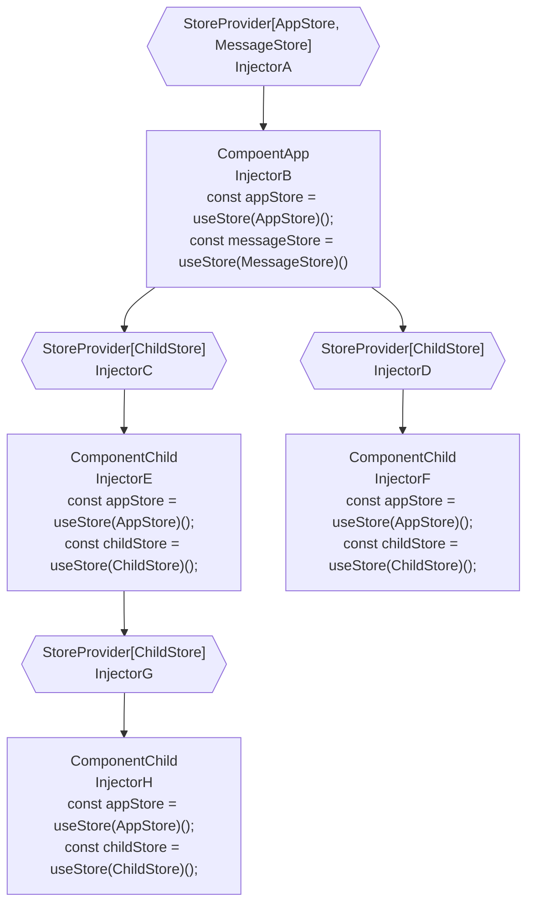

# pinia-id: Use [Pinia](https://github.com/vuejs/pinia) more flexibly!

DI(dependency-injection) for pinia. work with vue@3

[中文文档](./docs/zh-CN.md)

## Flow Chart



## Core Concepts

- `Store Tree`: The `store tree` is like the `component tree`, each component get the store form the latest `Injector`.
- `Injector`: The `store tree node` that used tomanagement stores (e.g. provide stores, and get stores).
- `StoreProvider`: A component that use `Injector` to provide stores for child components.
- `Store Use`: The `return` of [defineStore](https://pinia.vuejs.org/core-concepts/#defining-a-store).
- `Store Creator`: A function that return a `Store Use`.
- `InjectionContext`: The parameter that the `Store Creator` will receive.

## Define Store Creator

A `Store Creator` is a creator function that return the `Store Use`, like the creator `AppStore`:

```ts
import { defineStore } from 'pinia';
import { InjectionContext } from 'pinia-di';

export const AppStore = (ctx: InjectionContext) => {
  return defineStore(ctx.useStoreId('App'), {
    //...
  });
}
```

## InjectionContext: `{ getStore, useStoreId, onUnmounted }`

`getStore`: Get other store that have been provided by `current injector` or `parent injector`.
```ts
import { InjectionContext } from 'pinia-di';
import { OtherStore } from './stores/other';

export const AppStore = ({ getStore }: InjectionContext) => {
  return defineStore('app', {
    state: {},
    actions: {
      test() {
        // the OtherStore must be provided by `current injector` or  `parent injector`
        const otherStore = getStore(OtherStore)();
        console.log(otherStore.xx);
      }
    }
  });
}
```

`useStoreId`: Because `pinia` use `id` to identify one store, but our `Store Creator` maybe use multiple times, so we need a method `useStoreId` to generate the unique id.
```ts
import { InjectionContext } from 'pinia-di';
export const TestStore = ({ useStoreId }: InjectionContext) => {
  return defineStore(useStoreId('test'), {
    state: {},
  });
}
```

`onUnmounted`: Bind a function that will be invoked when the store unmounted.
```ts
import { InjectionContext } from 'pinia-di';
export const TestStore = ({ onUnmounted }: InjectionContext) => {
  const useTestStore = defineStore(useStoreId('test'), {
    state: {},
    actions: {
      dispose() {
        console.log('dispose');
      }
    }
  });

  onUnmounted(() => {
    useTestStore().dispose();
  });

  return useTestStore;
}
```

## Provide Store

Use `StoreProvider` to provide stores.

*** Tips: It's better to create a variable to represent the stores(e.g. `<StoreProvider :store="stores"`), not to use inline style like `<StoreProvider :store=[appStore]>` ***

Because `pinia-di` will create an new injector for these stores if the `props.stores` changes.

Although there is an internal mechanism to ensure that the store that is still in use will not be dispose and recreate, it is best not to do so.

> App.vue
```vue
<script setup>
import { StoreProvider } from 'pinia-di';
import { AppStore } from '@/stores/appStore';
const stores = [AppStore];
</script>

<template>
  <StoreProvider :stores="stores" name="app">
    <Main />
  </StoreProvider>
</template>
```

You also can provide stores in the `app.privide` for whole app.

`pinia-di` provide a helper function `getProvideArgs` to do this.

```ts
import { createApp } from 'vue';
import { getProvideArgs } from 'pinia-di';
import { AppStore } from '@/stores/appStore';

const app = createApp();
app.provide(...getProvideArgs([getProvideArgs], 'app'));

app.mount('#app');
```

## Use Store

> Component.vue
```vue
<script setup>
import { useStore } from 'pinia-di';
import { AppStore } from '@/stores/appStore';

const appStore = useStore(AppStore)();
</script>
```

## Store Out Of Componet: Singleton Store

*** Tips: If use use `Singleton Store`, you can't get `InjectionContext` when then store create ***

> stores/messageStore.ts
```ts
import { defineStore } from 'pinia';

export const MessageStore = (/* no `ctx: InjectionContext` */) => {
  return defineStore('message'), {
    state: {}
  });
}

export const useMessageStore = MessageStore();
```

Then, if you want to use the same store of `useMessageStore` for `MessageStore`, you will use the `use` flag when proivide stores. 

> App.vue
```vue
<script setup>
import { StoreProvider, useStore } from 'pinia-di';
import { AppStore } from '@/stores/appStore';
import { useMessageStore, MessageStore } from '@/stores/messageStore';

const stores = [
  AppStore, { creator: MessageStore, use: useMessageStore }
]
</script>

<template>
  <StoreProvider :stores="stores">
    <Main />
  </StoreProvider>
</template>
```

When the child components get store of `MessageStore`, they will get the `useMessageStore` that be created before, not to create new `Store Use`.

> Component.vue
```vue
<script setup>
import { useStore } from 'pinia-di';
import { MessageStore } from '@/stores/messageStore';

// messageStore === useMessageStore(): true
const messageStore = useStore(MessageStore)();
</script>
```

## Get Other Stores In One Sotre

> stores/userStore.ts
```ts
import { defineStore } from 'pinia';
import { useStoreId } from 'pinia-di';

export const UserStore = ({ getStore, useStoreId }: InjectionContext) => {
  return defineStore(useStoreId('user'), {
    state: {},
    actions: {
      test: () => {
        // get other store that parent component or self provided
        const appStore = getStore(AppStore);
        console.log(appStore.xxx);
      }
    }
  });
}
```

## Store Onunmounted

> stores/appStore.ts
```ts
import { defineStore } from 'pinia';

export const AppStore = ({ onUnmounted, useStoreId }: InjectionContext) => {
  // define store, useStoreId('main') generate the unique id for per `Store Instance`
  const useMainstore = defineStore(useStoreId('main'), {
    state: {},
    actions: {
      dispose: () => {
        //
      }
    }
  });

  onUnmounted(() => {
    useMainstore().dispose();
  });

  return useMainstore;
}
```

## Store Tree

If same `store creator` provided by more than one parent, the `useStore` will get the nearest one.

> ParentA.Vue
```vue
<template>
  <ParentB/>
</template>

<script setup>
import { StoreProvider } from 'pinia-di';
import { TestStore } from '@/stores/testStore';

const stores = [TestStore];
</script>

<template>
  <StoreProvider :stores="stores">
    <ParentB />
  </StoreProvider>
</template>
```

> ParentB.Vue
```vue
<template>
  <Child/>
</template>

<script setup>
import { provideStores } from 'pinia-di';
import { TestStore } from '@/stores/testStore';

const stores = [TestStore];
</script>

<template>
  <StoreProvider :stores="stores">
    <Child />
  </StoreProvider>
</template>
```

> Child.Vue
```vue
<script setup>
import { useStore } from 'pinia-di';
import { TestStore } from '@/stores/testStore';

// will get the store provided by ParentB
const testStore = useStore(TestStore)();
</script>
```
