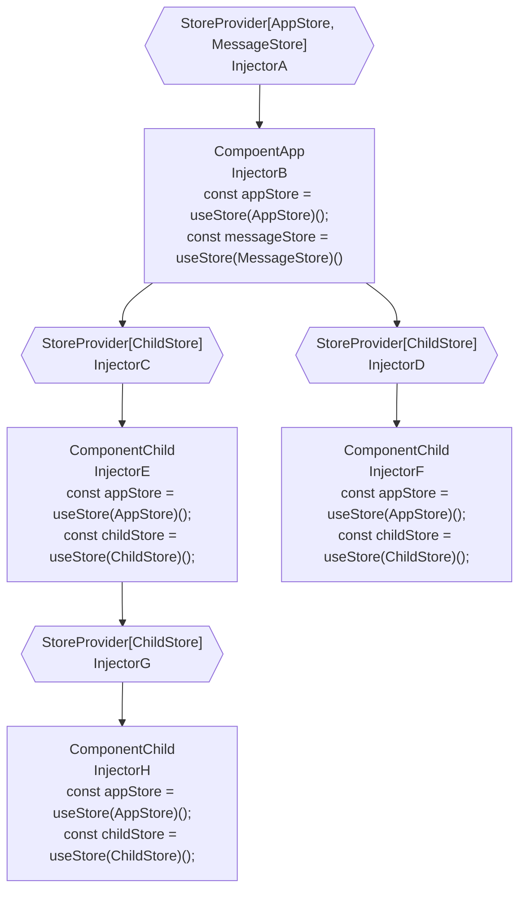

# pinia-di: Use [Pinia](https://github.com/vuejs/pinia) more flexibly!

> :fire: :fire: *A Better way to reuse stores*.

DI(dependency-injection) for pinia. work with vue@3.

## Installation

```sh
npm install pinia pinia-di
```

## Flow Chart



## Core Concepts

- `Injector`: Injects and provides stores in the component tree to current component or child components.
- `Store Tree`: The `store tree` is like the `component tree`, each component get the store from the nearest parent `Injector`.
- `StoreProvider`: A component that uses `Injector` to provide stores.
- `Store Use`: The return type of [defineStore](https://pinia.vuejs.org/core-concepts/#defining-a-store).
- `Store`: The return type of a `Store Use` function like [useStore()](https://pinia.vuejs.org/core-concepts/#using-the-store);
- `Store Creator`: A function that returns a `Store Use`.
- `InjectionContext`: The parameter that the `Store Creator` will receive.

## Define Store Creator

A `Store Creator` is a creator function that returns a `defineStore()` result.

For example: the `AppStore` is a `Store Creator`, and the return of `AppStore()` is `Store Use`:

```ts
import { defineStore } from 'pinia';
import { InjectionContext } from 'pinia-di';

// Store Creator
export const AppStore = (ctx: InjectionContext) => {
  return defineStore(ctx.useStoreId('App'), {
    //...
  });
}

// Store Use
const useAppStore = AppStore();

// Store
const appStore = useAppStore();
```

## InjectionContext: `{ getStore, useStoreId, onUnmounted }`

`getStore`: Get another store that has been provided by the `current injector` or `parent injector`.
```ts
import { InjectionContext } from 'pinia-di';
import { OtherStore } from './stores/other';

export const AppStore = ({ getStore }: InjectionContext) => {
  return defineStore('app', () => {
    const state = reactive({});
    const test = () => {
      // the OtherStore must be provided by `current injector` or  `parent injector`
        const otherStore = getStore(OtherStore);
        console.log(otherStore.xx);
    };
    
    return {
      state,
      test
    }
  });
}
```

`useStoreId`: Because `pinia` uses `id` to identify one store, but our `Store Creator` is reusable, you can use the method `useStoreId` to generate the unique id.
```ts
import { InjectionContext } from 'pinia-di';
export const TestStore = ({ useStoreId }: InjectionContext) => {
  // store id will be `test-1`, `test-2`, ...
  return defineStore(useStoreId('test'), () => {
    const state = reactive({});
    
    return {
      state
    }
  });
}
```

`onUnmounted`: Bind a function that will be invoked when the store is unmounted.
```ts
import { InjectionContext } from 'pinia-di';
export const TestStore = ({ onUnmounted }: InjectionContext) => {
  const useTestStore = defineStore(useStoreId('test'), () => {
    const state = reactive({});
    const dispose = async () => {
      console.log('dispose');
    };

    const remove = onUnmounted(dispose);
    // unbind the callback
    // remove()

    return {
      state
    }
  });

  return useTestStore;
}
```

## Provide Stores

You can use composition api `useProvideStores` or component `StoreProvider` to provide stores.

### `useProvideStores`

```vue
<script lang="ts" setup>
import { createApp } from 'vue';
import { useProvideStores, useStore } from 'pinia-di';
import { TestStore } from '@/stores/testStore';

// the testStore is provided by parent injector
const testStore = useStore(TestStore);

// 'test' is the injector name that helps to debug
useProvideStores([TestStore], 'test');

// testStoreNew is provided by the `useProvideStores` above
const testStoreNew = useStore(TestStore);
</script>
```

### `StoreProvider`

Use `StoreProvider` to provide stores.

> :fire: Tip: Because the stores prop is only used once, if it changes after the component is mounted, the new store prop will be ignored. 

> :fire: If you want to conditionally provide different stores, you need to write different components to provide each self.

> App.vue
```vue
<script setup>
import { StoreProvider } from 'pinia-di';
import { AppStore } from '@/stores/appStore';
import { TestStore } from '@/stores/testStore';
</script>

<template>
  <!-- // 'app' is the injector name that help to debug -->
  <StoreProvider :stores="[AppStore]" name="app">
    <Main />

    <div>
      <StoreProvider :stores="[TestStore]">
        <div>test a</div>
      </StoreProvider>
      
      <StoreProvider :stores="[TestStore]">
        <div>test n</div>
      </StoreProvider>
    </div>
  </StoreProvider>
</template>
```

And, you can provide stores in the `app.provide` for the whole vue app.

`pinia-di` provides a helper function `getProvideArgs` to do this.

```ts
import { createApp } from 'vue';
import { getProvideArgs } from 'pinia-di';
import { AppStore } from '@/stores/appStore';

const app = createApp();
// 'app' is the injector name that help to debug
app.provide(...getProvideArgs([AppStore], 'app'));

app.mount('#app');
```

## Using Store

> Component.vue
```vue
<script setup>
import { useStore } from 'pinia-di';
import { AppStore } from '@/stores/appStore';

const appStore = useStore(AppStore);
</script>
```

## Store Out Of Component: Singleton Store

*** Tips: If you use a `Singleton Store`, you can't get `InjectionContext` when then store is created ***

> stores/messageStore.ts
```ts
import { defineStore } from 'pinia';

export const MessageStore = (/* no `ctx: InjectionContext` */) => {
  return defineStore('message'), {
    state: {}
  });
}

export const useMessageStore = MessageStore();
```

Then, if you want to use the same store of `messageStore` for `MessageStore`, you will use the `use` flag when you provide stores.

> App.vue
```vue
<script setup>
import { StoreProvider, useStore } from 'pinia-di';
import { AppStore } from '@/stores/appStore';
import { useMessageStore, MessageStore } from '@/stores/messageStore';

const stores = [
  AppStore, { creator: MessageStore, use: useMessageStore }
]
</script>

<template>
  <StoreProvider :stores="stores">
    <Main />
  </StoreProvider>
</template>
```

When the child components get the store from `useStore(MessageStore)`, they will get the same store returned by `useMessageStore()` that was created before, not create new `messageStore`.

> Component.vue
```vue
<script setup>
import { useStore } from 'pinia-di';
import { MessageStore } from '@/stores/messageStore';

// messageStore === useMessageStore(): true
const messageStore = useStore(MessageStore);
</script>
```

## Get Other Stores In One Store

> stores/userStore.ts
```ts
import { defineStore } from 'pinia';
import { useStoreId } from 'pinia-di';

export const UserStore = ({ getStore, useStoreId }: InjectionContext) => {
  return defineStore(useStoreId('user'), () => {
    const state = reactive({});
    const test = () => {
      // get another store that the parent component or self provided
        const appStore = getStore(AppStore);
        console.log(appStore.xxx);
    };
    
    return {
      state,
      test
    }
  });
}
```

## Store OnUnmounted

> stores/appStore.ts
```ts
import { defineStore } from 'pinia';

export const AppStore = ({ onUnmounted, useStoreId }: InjectionContext) => {
  // define store, useStoreId('main') generate the unique id per `Store Instance`
  return defineStore(useStoreId('main'), () => {
    const state = reactive({});
    const dispose = async () => {
      // console.log('dispose')
    };

    onUnmounted(dispose);

    return {
      state
    };
  });
}
```

## Store Tree

If the same `store creator` is provided by more than one parent, the `useStore` will get the nearest one.

> ParentA.Vue
```vue
<template>
  <ParentB/>
</template>

<script setup>
import { StoreProvider } from 'pinia-di';
import { TestStore } from '@/stores/testStore';

const stores = [TestStore];
</script>

<template>
  <StoreProvider :stores="stores">
    <ParentB />
  </StoreProvider>
</template>
```

> ParentB.Vue
```vue
<template>
  <Child/>
</template>

<script setup>
import { provideStores } from 'pinia-di';
import { TestStore } from '@/stores/testStore';

const stores = [TestStore];
</script>

<template>
  <StoreProvider :stores="stores">
    <Child />
  </StoreProvider>
</template>
```

> Child.Vue
```vue
<script setup>
import { useStore } from 'pinia-di';
import { TestStore } from '@/stores/testStore';

// will get the store provided by ParentB
const testStore = useStore(TestStore);
</script>
```

## disposeOnUnmounted

`pinia-di` will call `store.$dispose()` when the injected component is unmounted.

If do not want this, you can use `disposeOnUnmounted` to disable it.

```vue
<script setup>
import { provideStores } from 'pinia-di';
import { TestStore } from '@/stores/testStore';

const stores = [
  { creator: TestStore, disposeOnUnmounted: false }
];
</script>
```
