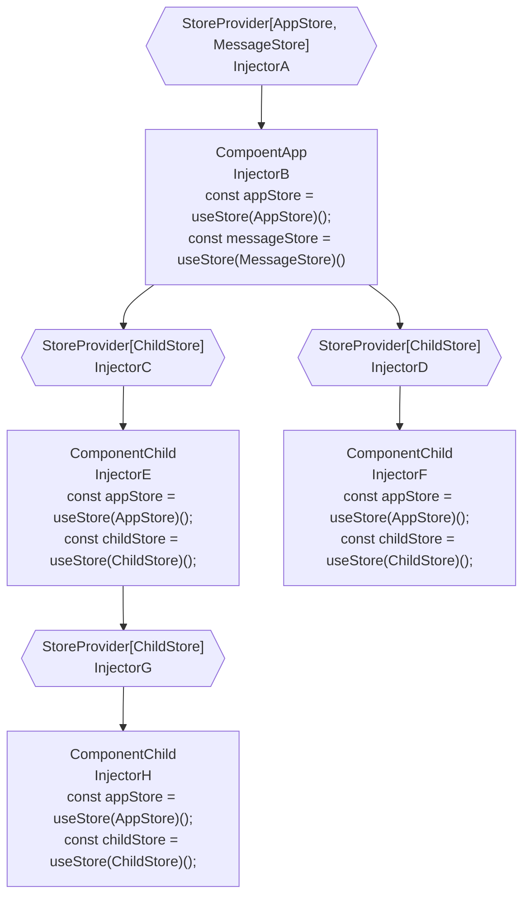

# pinia-di: 更灵活地使用 [Pinia](https://github.com/vuejs/pinia)!

> :fire: :fire: *更好地重用 stores*.

DI(dependency-injection) for pinia. work with vue@3

## 流程图



## 核心概念

- `Injector`: 在组件树中给当前组件和子孙组件注入和提供 stores。
- `Store Tree`: `store tree` 和 `component tree`类似, 每个组件从最近的 `Injector` 获取 store。
- `StoreProvider`: 一个辅助组件，使用 `Injector` 来提供 stores。
- `Store Use`: [defineStore](https://pinia.vuejs.org/core-concepts/#defining-a-store) 的返回类型。
- `Store`: `Store Use` 的返回值，和 [useStore()](https://pinia.vuejs.org/core-concepts/#using-the-store) 一样。
- `Store Creator`: 一个函数，返回 `Store Use`.
- `InjectionContext`: `Store Creator` 会接收到的参数。

## 定义 Store Creator

`Store Creator` 是一个能返回 `defineStore` 的函数。

例如: `AppStore` 是 `Store Creator`,  `AppStore()` 的返回值是 `Sotre Use`:

```ts
import { defineStore } from 'pinia';
import { InjectionContext } from 'pinia-di';

// Store Creator
export const AppStore = (ctx: InjectionContext) => {
  return defineStore(ctx.useStoreId('App'), {
    //...
  });
}

// Store Use
const useAppStore = AppStore();

// Store
const appStore = useAppStore();
```

## InjectionContext: `{ getStore, useStoreId, onUnmounted }`

`getStore`: Get other store that have been provided by `current injector` or `parent injector`.
```ts
import { InjectionContext } from 'pinia-di';
import { OtherStore } from './stores/other';

export const AppStore = ({ getStore }: InjectionContext) => {
  return defineStore('app', () => {
    const state = reactive({});
    const test = () => {
      // the OtherStore must be provided by `current injector` or  `parent injector`
        const otherStore = getStore(OtherStore);
        console.log(otherStore.xx);
    };
    
    return {
      state,
      test
    }
  });
}
```

`useStoreId`: Because `pinia` use `id` to identify one store, but our `Store Creator` is reusable, so we need a method `useStoreId` to generate the unique id.
```ts
import { InjectionContext } from 'pinia-di';
export const TestStore = ({ useStoreId }: InjectionContext) => {
  // store id will be `test-1`, `test-2`, ...
  return defineStore(useStoreId('test'), () => {
    const state = reactive({});
    
    return {
      state
    }
  });
}
```

`onUnmounted`: Bind a function that will be invoked when the store unmounted.
```ts
import { InjectionContext } from 'pinia-di';
export const TestStore = ({ onUnmounted }: InjectionContext) => {
  const useTestStore = defineStore(useStoreId('test'), () => {
    const state = reactive({});
    const dispose = async (isCreated) => {
      console.log('dispose');
    };

    const remove = onUnmounted(dispose);
    // you can aslo remove the callback by
    // remove()

    return {
      state
    }
  });

  return useTestStore;
}
```

## Provide Stores

You can use composition api `useProvideStores` to provide stores.

```ts
import { createApp } from 'vue';
import { useProvideStores, useStore } from 'pinia-di';
import { AppStore } from '@/stores/appStore';

const app = createApp({
  setup() {
    // 'app' is the injector name that help to debug
    useProvideStores([AppStore], 'app');
    const appStore = useStore(AppStore);
    cosnt otherStore = useStore(OtherStore);
    //...
  }
});
app.mount('#app');
```

Use `StoreProvider` to provide stores.

> ::fire:: Tip: It is recommended to define stores in the `script`, not in the `props`.

> ::fire:: Tip: Because the stores prop only use once, if changes after component mounted, the new stores prop will be ignored. 

> ::fire:: If you want to conditionally provide diffrent stores, you need to write diffrent components to provide each self.

> App.vue
```vue
<script setup>
import { StoreProvider } from 'pinia-di';
import { AppStore } from '@/stores/appStore';

const stores = [AppStore];
</script>

<template>
  <!-- // 'app' is the injector name that help to debug -->
  <StoreProvider :stores="stores" name="app">
    <Main />
  </StoreProvider>
</template>
```

And, you can provide stores in the `app.privide` for whole app.

`pinia-di` provide a helper function `getProvideArgs` to do this.

```ts
import { createApp } from 'vue';
import { getProvideArgs } from 'pinia-di';
import { AppStore } from '@/stores/appStore';

const app = createApp();
// 'app' is the injector name that help to debug
app.provide(...getProvideArgs([getProvideArgs], 'app'));

app.mount('#app');
```

## Using Store

> Component.vue
```vue
<script setup>
import { useStore } from 'pinia-di';
import { AppStore } from '@/stores/appStore';

const appStore = useStore(AppStore);
</script>
```

## Store Out Of Componet: Singleton Store

*** Tips: If use use `Singleton Store`, you can't get `InjectionContext` when then store create ***

> stores/messageStore.ts
```ts
import { defineStore } from 'pinia';

export const MessageStore = (/* no `ctx: InjectionContext` */) => {
  return defineStore('message'), {
    state: {}
  });
}

export const useMessageStore = MessageStore();
```

Then, if you want to use the same store of `messageStore` for `MessageStore`, you will use the `use` flag when proivide stores.

> App.vue
```vue
<script setup>
import { StoreProvider, useStore } from 'pinia-di';
import { AppStore } from '@/stores/appStore';
import { useMessageStore, MessageStore } from '@/stores/messageStore';

const stores = [
  AppStore, { creator: MessageStore, use: useMessageStore }
]
</script>

<template>
  <StoreProvider :stores="stores">
    <Main />
  </StoreProvider>
</template>
```

When the child components get store of `useStore(MessageStore)`, they will get the `useMessageStore()` that be created before, not to create new `Store Use`.

> Component.vue
```vue
<script setup>
import { useStore } from 'pinia-di';
import { MessageStore } from '@/stores/messageStore';

// messageStore === useMessageStore(): true
const messageStore = useStore(MessageStore);
</script>
```

## Get Other Stores In One Sotre

> stores/userStore.ts
```ts
import { defineStore } from 'pinia';
import { useStoreId } from 'pinia-di';

export const UserStore = ({ getStore, useStoreId }: InjectionContext) => {
  return defineStore(useStoreId('user'), () => {
    const state = reactive({});
    const test = () => {
      // get other store that parent component or self provided
        const appStore = getStore(AppStore);
        console.log(appStore.xxx);
    };
    
    return {
      state,
      test
    }
  });
}
```

## Store Onunmounted

> stores/appStore.ts
```ts
import { defineStore } from 'pinia';

export const AppStore = ({ onUnmounted, useStoreId }: InjectionContext) => {
  // define store, useStoreId('main') generate the unique id for per `Store Instance`
  return defineStore(useStoreId('main'), () => {
    const state = reactive({});
    const dispose = async () => {
      // console.log('dispose')
    };

    onUnmounted(dispose);

    return {
      state
    };
  });
}
```

## Store Tree

If same `store creator` provided by more than one parent, the `useStore` will get the nearest one.

> ParentA.Vue
```vue
<template>
  <ParentB/>
</template>

<script setup>
import { StoreProvider } from 'pinia-di';
import { TestStore } from '@/stores/testStore';

const stores = [TestStore];
</script>

<template>
  <StoreProvider :stores="stores">
    <ParentB />
  </StoreProvider>
</template>
```

> ParentB.Vue
```vue
<template>
  <Child/>
</template>

<script setup>
import { provideStores } from 'pinia-di';
import { TestStore } from '@/stores/testStore';

const stores = [TestStore];
</script>

<template>
  <StoreProvider :stores="stores">
    <Child />
  </StoreProvider>
</template>
```

> Child.Vue
```vue
<script setup>
import { useStore } from 'pinia-di';
import { TestStore } from '@/stores/testStore';

// will get the store provided by ParentB
const testStore = useStore(TestStore);
</script>
```

## disposeOnUnmounted

`pinia-di` will call `store.$dispose()` when then inject component unmounted.

If do not want the, you can use `disposeOnUnmounted` to disable it.

```vue
<script setup>
import { provideStores } from 'pinia-di';
import { TestStore } from '@/stores/testStore';

const stores = [
  { creator: TestStore, disposeOnUnmounted: false }
];
</script>
```