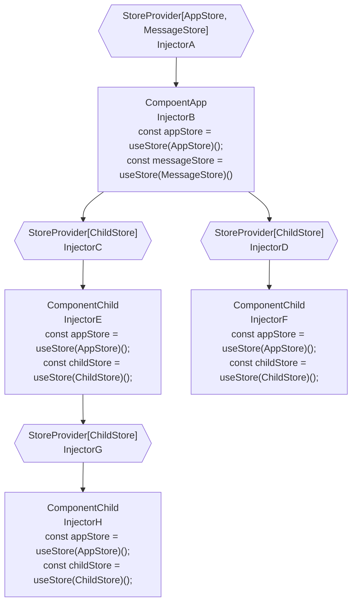

# pinia-id: 更灵活地使用 [Pinia](https://github.com/vuejs/pinia)！

在 [Pinia](https://github.com/vuejs/pinia) 中使用 DI(dependency-injection：依赖注入)。 依赖 vue@3。

[English Document](../README.md)

## 流程图



## 主要概念

- `Store Tree`: `Store 树` 和 `组件树`类似，每个组件从`Store 树`中最近的注入器`Injector`中获取`Store`。
- `Injector`: 注入器，`Store 树`中的一个节点，用来管理`Store`：提供`Store`和获取`Store`。
- `StoreProvider`: 用来提供`Store`的组件，它提供的`Store`能被子组件使用。
- `Store Use`: 以后简称`Sotre`，[defineStore](https://pinia.vuejs.org/core-concepts/#defining-a-store) 的返回值。
- `Store Creator`: `Store`构造器，调用它后会返回一个`Store Use`.
- `InjectionContext`:`Store`构造器的上下文环境，具体下面会介绍。

## 创建一个`Store`构造器

`Store`构造器是一个返回`Store Use`的函数，例如`AppStore`构造器:

```ts
import { defineStore } from 'pinia';
import { InjectionContext } from 'pinia-di';

export const AppStore = (ctx: InjectionContext) => {
  return defineStore(ctx.useStoreId('App'), {
    //...
  });
}
```

## InjectionContext: `{ getStore, useStoreId, onUnmounted }`

`getStore`: 从当前的注入器`current injector`或者父注入器`parent injector`中获取`Store Use`。

```ts
import { InjectionContext } from 'pinia-di';
import { OtherStore } from './stores/other';

export const AppStore = ({ getStore }: InjectionContext) => {
  return defineStore('app', {
    state: {},
    actions: {
      test() {
        // OtherStore 必须已经被当前的注入器`current injector`或者父注入器`parent injector` 提供。
        const otherStore = getStore(OtherStore)();
        console.log(otherStore.xx);
      }
    }
  });
}
```

`useStoreId`: 因为 `pinia` 使用 `id` 来标识唯一`Sotre`, 但是`Sotre`构造器可能会调用多次并且创建多个`Sotre`，所以我们需要一个方法`useStoreId`去自动生成唯一的`id`。
```ts
import { InjectionContext } from 'pinia-di';
export const TestStore = ({ useStoreId }: InjectionContext) => {
  return defineStore(useStoreId('test'), {
    state: {},
  });
}
```

`onUnmounted`: 绑定一个在`Sotre`卸载时调用的方法。
```ts
import { InjectionContext } from 'pinia-di';
export const TestStore = ({ onUnmounted }: InjectionContext) => {
  const useTestStore = defineStore(useStoreId('test'), {
    state: {},
    actions: {
      dispose() {
        console.log('dispose');
      }
    }
  });

  onUnmounted(() => {
    useTestStore().dispose();
  });

  return useTestStore;
}
```

## 提供`Sotre`

使用 `StoreProvider` 组件来提供`Sotre`。

*** 注意: 最好创建一个变量来存储需要提供的`Sotre`(例如 `<StoreProvider :store="stores"`)，而不是使用行内表达式：`<StoreProvider :store=[appStore]>` ***

因为 `props.sotres`改变的时候，`pinia-di` 会重新创建一个新的注入器，如果是行内表达式的话每次渲染都会重新创建一次。

虽然`pinia-di`内部会有机制去保证还在使用的`Sotre`不会被销毁和重新创建，但是最好不要这样做，因为这也是一笔开销。

> App.vue
```vue
<script setup>
import { StoreProvider } from 'pinia-di';
import { AppStore } from '@/stores/appStore';
const stores = [AppStore];
</script>

<template>
  <StoreProvider :stores="stores" name="app">
    <Main />
  </StoreProvider>
</template>
```

你也可以在全局使用`app.privide`来给整个app提供`Sotre`。

`pinia-di` 提供了一个辅助方法 `getProvideArgs` 来做这件事。

```ts
import { createApp } from 'vue';
import { getProvideArgs } from 'pinia-di';
import { AppStore } from '@/stores/appStore';

const app = createApp();
app.provide(...getProvideArgs([getProvideArgs], 'app'));

app.mount('#app');
```

## 使用`Sotre`。

> Component.vue
```vue
<script setup>
import { useStore } from 'pinia-di';
import { AppStore } from '@/stores/appStore';

const appStore = useStore(AppStore)();
</script>
```

## 脱离组件的`Sotre`: 单例`Sotre`。

*** 注意: 如果使用单例`Sotre`，你将不能在创建`Sotre`时访问`InjectionContext` ***

> stores/messageStore.ts
```ts
import { defineStore } from 'pinia';

export const MessageStore = (/* no `ctx: InjectionContext` */) => {
  return defineStore('message'), {
    state: {}
  });
}

export const useMessageStore = MessageStore();
```

然后，如果你想获取`MessageStore`的单例`Sotre`：`useMessageStore`，你需要在提供`Sotre`的时候使用`use`标志。

> App.vue
```vue
<script setup>
import { StoreProvider, useStore } from 'pinia-di';
import { AppStore } from '@/stores/appStore';
import { useMessageStore, MessageStore } from '@/stores/messageStore';

const stores = [
  AppStore, { creator: MessageStore, use: useMessageStore }
]
</script>

<template>
  <StoreProvider :stores="stores">
    <Main />
  </StoreProvider>
</template>
```

当自组件通过`MessageStore`获取`Sotre`时, 它们将得到以前就创建的`useMessageStore`，而不是重新创建一个。

> Component.vue
```vue
<script setup>
import { useStore } from 'pinia-di';
import { MessageStore } from '@/stores/messageStore';

// messageStore === useMessageStore(): true
const messageStore = useStore(MessageStore)();
</script>
```

## 在`Sotre`中获取其他`Sotre`。

> stores/userStore.ts
```ts
import { defineStore } from 'pinia';
import { useStoreId } from 'pinia-di';

export const UserStore = ({ getStore, useStoreId }: InjectionContext) => {
  return defineStore(useStoreId('user'), {
    state: {},
    actions: {
      test: () => {
        // get other store that parent component or self provided
        const appStore = getStore(AppStore);
        console.log(appStore.xxx);
      }
    }
  });
}
```

## `Sotre`卸载回调

> stores/appStore.ts
```ts
import { defineStore } from 'pinia';

export const AppStore = ({ onUnmounted, useStoreId }: InjectionContext) => {
  // define store, useStoreId('main') generate the unique id for per `Store Instance`
  const useMainstore = defineStore(useStoreId('main'), {
    state: {},
    actions: {
      dispose: () => {
        //
      }
    }
  });

  onUnmounted(() => {
    useMainstore().dispose();
  });

  return useMainstore;
}
```

## `Sotre`树

如果一个`Sotre`构造器背多个父组件提供，自组件将会得到最近的一个。

> ParentA.Vue
```vue
<template>
  <ParentB/>
</template>

<script setup>
import { StoreProvider } from 'pinia-di';
import { TestStore } from '@/stores/testStore';

const stores = [TestStore];
</script>

<template>
  <StoreProvider :stores="stores">
    <ParentB />
  </StoreProvider>
</template>
```

> ParentB.Vue
```vue
<template>
  <Child/>
</template>

<script setup>
import { provideStores } from 'pinia-di';
import { TestStore } from '@/stores/testStore';

const stores = [TestStore];
</script>

<template>
  <StoreProvider :stores="stores">
    <Child />
  </StoreProvider>
</template>
```

> Child.Vue
```vue
<script setup>
import { useStore } from 'pinia-di';
import { TestStore } from '@/stores/testStore';

// will get the store provided by ParentB
const testStore = useStore(TestStore)();
</script>
```
